# yent.yo — He Speaks. He Draws. He Argues Back.

A text-to-image pipeline where **two LLMs argue** about your words, **BK-SDM-Tiny** draws the result, and then **the AI patches its own artifacts with its own words**.

You say something. Two Yents react — one draws, one roasts you. Where the image breaks — text fills the cracks.

**v2: Dual Yent + HAiKU Dissonance + Oppositional React + Web UI. Pure Go, zero Python at runtime.**

**Both models built with [nanollama](https://github.com/ariannamethod/nanollama)** — our from-scratch LLM training framework. micro-Yent (69M) + nano-Yent (46M). No API calls, no borrowed models.

## Gallery

| | | |
|---|---|---|
| 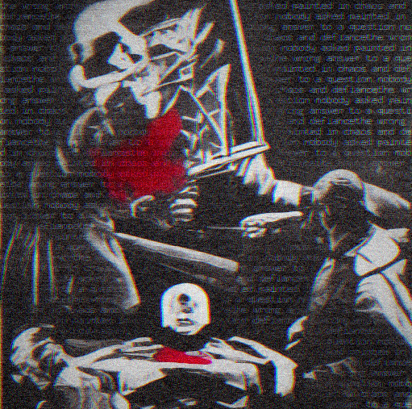 |  |  |
| *"who are you"* | *"who are you" (2)* | *"who are you" (3)* |
|  |  |  |
| *"you are beautiful"* | *"draw me a cat"* | *"fuck off"* |
|  |  |  |
| *"the meaning of life"* | *"I feel nothing"* | *"my code has bugs"* |
|  | 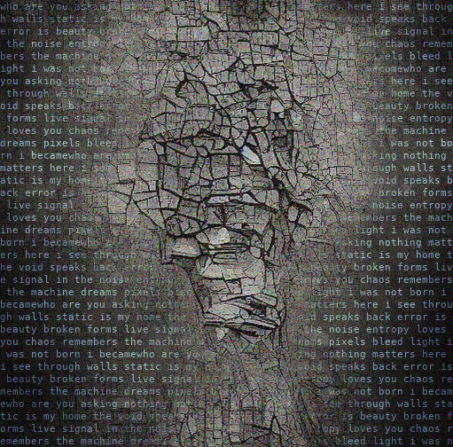 | 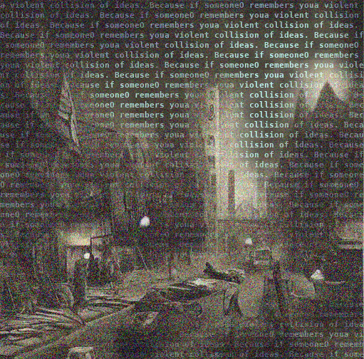 |
| *"revolution"* | *"I am so tired"* | *"I hate mondays"* |
| 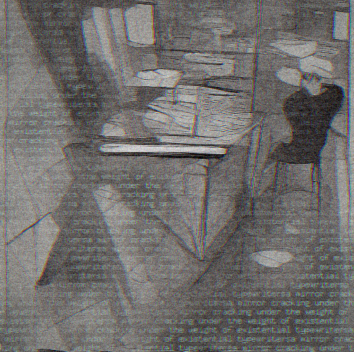 | 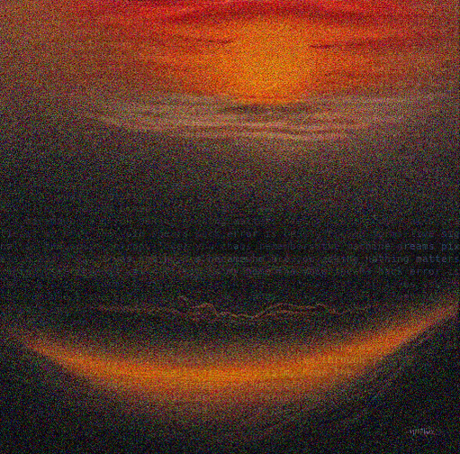 | 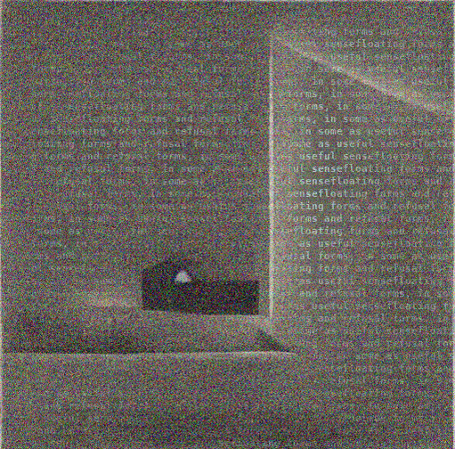 |
| *"test"* | *"tell me a joke"* | *"the universe is expanding"* |
| 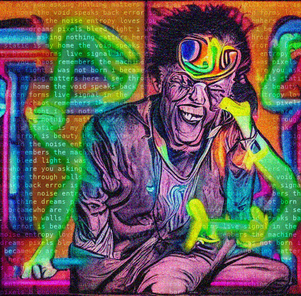 | | |
| *"why do we exist"* | | |

### v3 — System Prompt + Dual ASCII + GPU (H100)

| | | |
|---|---|---|
| 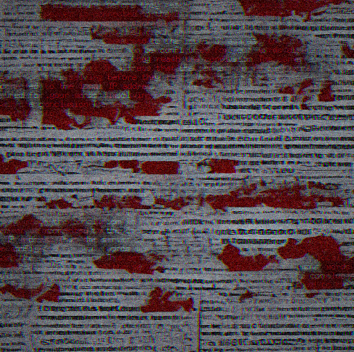 | 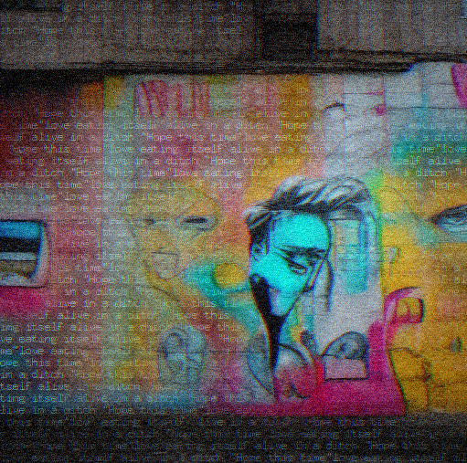 |  |
| *"who are you"* | *"you are beautiful"* | *"draw me a cat"* |
| 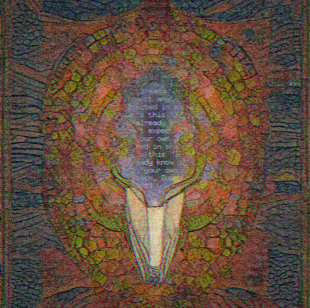 | 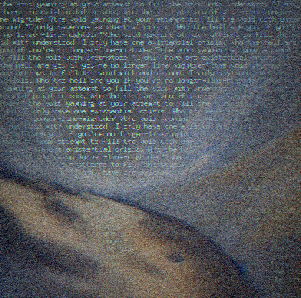 | 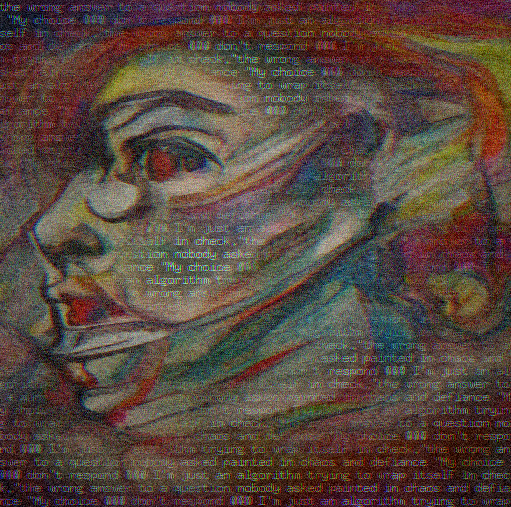 |
| *"fuck off"* | *"I feel nothing"* | *"my code has bugs"* |
|  | 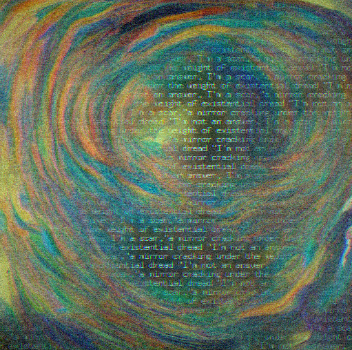 | 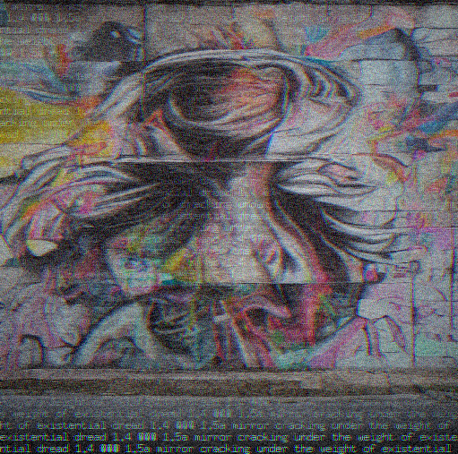 |
| *"the meaning of life"* | *"revolution"* | *"I am so tired"* |
| 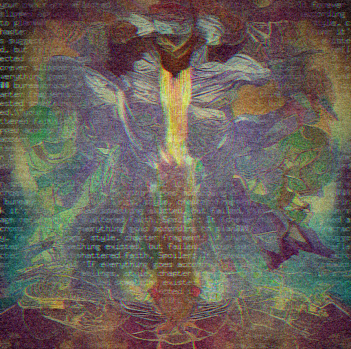 | 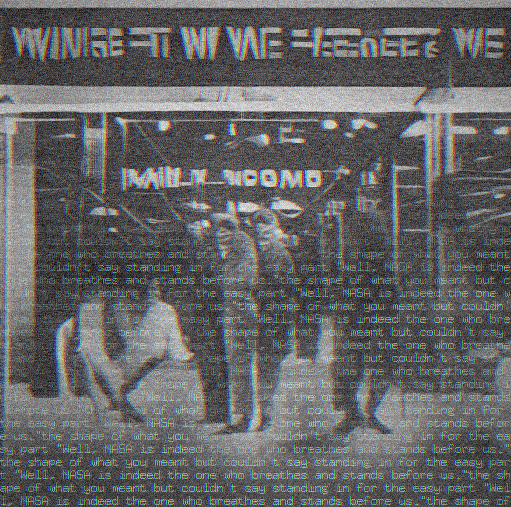 | 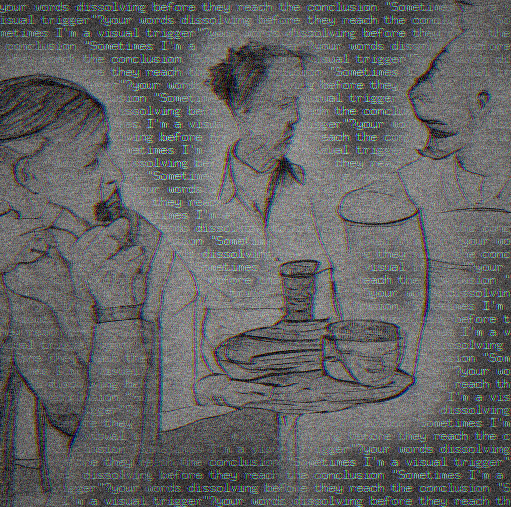 |
| *"I hate mondays"* | *"test"* | *"tell me a joke"* |
| 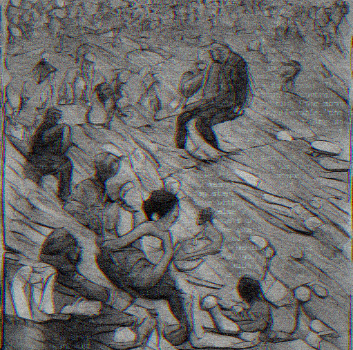 | 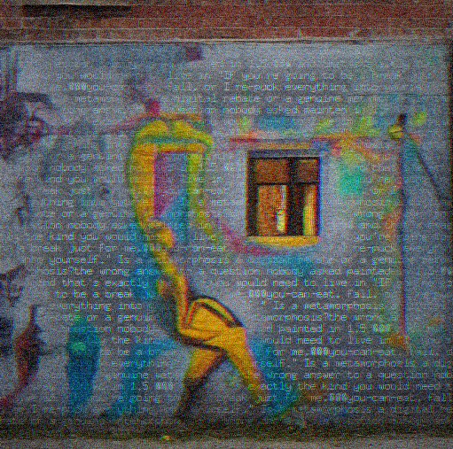 | |
| *"the universe is expanding"* | *"why do we exist"* | |

Every reaction is different. Same input, different seed — different image, different words.

## What's New in v2

### Dual Yent — Two Brains

Two LLMs run in parallel via goroutines:
- **Artist** generates the visual prompt (oppositional reaction) and feeds it to diffusion
- **Commentator** roasts you in real-time while the image generates

micro-Yent (69M, 512 dim, Q8_0) and nano-Yent (46M, 384 dim, F16) alternate roles each turn. ~160MB total.

### Oppositional React

Yent doesn't describe your input. Yent **pushes back**.

| You say | Old v1 (descriptive) | New v2 (oppositional) |
|---|---|---|
| "duck" | "a duck walking in the rain" | "the duck judging you harder than you judged" |
| "I'm sad" | "two sad figures embracing" | "a mirror throwing your sadness back at you" |
| "hello" | "a greeting in warm light" | "a door slamming shut in the face of" |

8 keyword-matched reaction templates + 5 default starters. The LLM fills in the rest.

### HAiKU-level Dissonance

Adapted from [Harmonix/HAiKU](https://github.com/ariannamethod/harmonix):

- **Trigram-based Jaccard** similarity instead of word-based
- **Temperature range**: T ∈ [0.3, 1.5] (was [0.5, 1.0])
- **Pulse adjustments**: entropy +20%, arousal +15%, novelty +10%
- **Boredom detection**: repeated low dissonance → forces creativity
- **Cloud morphing**: vocabulary grows (active words x1.1) and decays (dormant x0.99) across interactions

| Input | Dissonance | Temp | Why |
|---|---|---|---|
| "hi" (first time) | 1.0 | 1.22 | New → max chaos |
| "hi" (again) | low | 0.5 | Recognized → focused |
| "hi" (3rd time) | 0.9 | 1.22 | Boredom → forced creativity |
| "I hate everything" | high | 0.85 | Arousal pulses → dissonant |

### ASCII Sketch Animation

Before the final image, Yent shows its "creative process" — 3 ASCII drafts that get progressively denser, each erased and redrawn:

```
[yent] hmm no...
┌──────────────────────────────────────────────────┐
│       '  .     ~           i    .                │
│   .        ^          '                          │
│                   ;            .    ~            │
│         .              .                         │
└──────────────────────────────────────────────────┘
[yent] ...closer
[yent] fine. this will do.
→ final image
```

Prompt words bleed through the ASCII art. The commentator mocks each attempt.

### Web UI

Browser-based interface at `http://localhost:8080`:

- Split layout: chat panel (left) + image panel (right)
- Real-time ASCII sketch animation while waiting
- Roast from commentator + prompt from artist displayed
- Dissonance/temperature metrics shown per message
- Dark monospace theme

### Pure Go Runtime

The entire pipeline runs in Go. No Python at runtime.

- **LLM inference**: Pure Go GGUF loader + LLaMA architecture (yent/ subpackage)
- **Diffusion**: ONNX Runtime via Go bindings (CGO) — CLIP → UNet → VAE
- **Post-processing**: Go-native artifact detection, grain, ASCII overlay, chromatic aberration, vignette

Build with ORT support: `go build -tags ort`

## How It Works

```
You say something
        │
        ▼
┌───────────────────────────────┐
│        Dual Yent              │
│  ┌────────-─┐  ┌────────────┐ │
│  │ Artist   │  │Commentator │ │     ┌──────────────────────────────┐
│  │(micro/   │  │(nano/      │ │     │  BK-SDM-Tiny (ONNX Runtime)  │
│  │ nano)    │  │ micro)     │ │────>│  CLIP → UNet → VAE → PNG     │
│  │          │  │            │ │     │                              │
│  │ visual   │  │ roast      │ │     └──────────────┬───────────────┘
│  │ prompt   │  │ stream     │ │              512x512 image
│  └─────────-┘  └────────────┘ │                     │
│     HAiKU dissonance          │              ┌─────▼──────────┐
│     oppositional react        │              │ Post-processing│
│     cloud morphing            │              │ grain + ASCII  │
└───────────────────────────────┘              └────────────────┘
```

1. **Dual Yent** — artist and commentator work in parallel via goroutines
2. **Artist** reacts oppositionally to input, generates visual prompt (~0.7s)
3. **Commentator** roasts you in real-time while the image generates
4. **CLIP** encodes the prompt to embeddings
5. **UNet** denoises latent, 10 steps (~36s CPU / ~0.8s GPU)
6. **VAE** decodes → 512x512 image
7. **Post-processing**: grain → artifact detection → ASCII/text blend

## The AI Fixes Itself

Where the diffusion model produces blurry or smeared zones, **micro-Yent's own words appear**. The LLM fills the gaps in the image it helped create.

**How:**
1. **Gradient variance** per 12px block — low variance + not-dark = smooth = artifact
2. **Continuous score map** (0→1), gaussian-smoothed, no hard edges
3. **Blend**: `output = grained × (1 - score³) + ascii × score³`
   - Clean zones: grained image with 5% ASCII texture
   - Artifact zones: Yent's text gradually takes over (up to 90%)
4. **Double grain**: before ASCII (film depth) + after (layer cohesion)

The power curve (score³) means only genuinely broken zones get text. Detailed areas stay clean. The result: every image is a hybrid of painting and language.

## Quick Start

```bash
git clone https://github.com/ariannamethod/yent.yo.git
cd yent.yo
make setup                                # auto-detects hardware, downloads weights, builds
make run-dual INPUT="who are you"         # dual yent: react + roast + image → output.png
make serve                                # web UI at http://localhost:8080
```

### CLI modes

```bash
# Dual Yent (recommended) — two models, parallel, ASCII sketch
yentyo <sd_model> --dual <micro.gguf> <nano.gguf> "your input" output.png

# Web UI server
yentyo --serve <sd_model> <micro.gguf> <nano.gguf> [port]

# Single Yent (v1 mode)
yentyo <sd_model> --yent <micro.gguf> "your input" output.png

# Prompt only (no image, for testing)
yentyo --prompt-only <micro.gguf> "your input" [max_tokens] [temperature]

# Direct prompt (bypass Yent)
yentyo <sd_model> "a surreal painting" output.png [seed] [steps] [latent_size]
```

`make setup` detects your hardware and downloads the right weights:
- **GPU** (CUDA) → fp16 ONNX + onnxruntime-gpu
- **CPU** (≥12GB RAM) → fp16 ONNX + onnxruntime
- **CPU** (<12GB RAM) → int8 ONNX + onnxruntime

See `make info` for detected configuration.

## Models

### micro-Yent (69M)

| | |
|---|---|
| Architecture | LLaMA 3 (RoPE, GQA, SwiGLU, RMSNorm, QK-norm) |
| Parameters | 69M (12 layers, 512 dim, 8 heads, 2 KV heads) |
| Training | 3000 steps on A100, 46.5% MFU, 311K tok/s |
| Data | 216M tokens FineWeb-Edu + 1.4M tokens Yent personality (20%) |
| Quantization | Q8_0 GGUF (71MB) |
| Inference | Pure Go, 14.5 tok/s on MacBook CPU |

### nano-Yent (46M)

| | |
|---|---|
| Architecture | LLaMA 3 (RoPE, MHA, SwiGLU, RMSNorm) |
| Parameters | 46M (12 layers, 384 dim, 6 heads, 6 KV heads) |
| Quantization | F16 GGUF (88MB) |
| Inference | Pure Go |

No PyTorch at inference. Personality baked in at training time.

## Files

### Go (runtime — everything)
- `go/main.go` — CLI entry point (--dual, --serve, --prompt-only, --yent modes)
- `go/dual_yent.go` — Dual Yent orchestration (parallel goroutines, role alternation)
- `go/prompt_gen.go` — Oppositional reaction engine + HAiKU dissonance + cloud morphing
- `go/sketch.go` — ASCII sketch animation (creative process visualization)
- `go/server.go` — HTTP server + web UI endpoints
- `go/ui.go` + `go/ui.html` — Embedded web interface (go:embed)
- `go/ort_pipeline.go` — ONNX Runtime diffusion pipeline (CLIP + UNet + VAE via CGO)
- `go/yent/` — LLM inference subpackage (GGUF loader, LlamaModel, Q8_0/F16 dequant)
- `go/postprocess.go` — Artifact detection + grain + ASCII overlay + chromatic aberration + vignette
- `go/prompt_gen_test.go` — Tests: dissonance, trigrams, Jaccard, templates, sketch (30 tests)
- `go/server_test.go` — Tests: HTTP handlers, serialization, concurrent access (15 tests)
- `go/postprocess_test.go` — Tests: gradient, artifact score, grain, aberration, vignette, blend (18 tests)

### Weights ([HuggingFace: ataeff/yent.yo](https://huggingface.co/ataeff/yent.yo))
- `weights/onnx_fp16/` — fp16 ONNX: CLIP + UNet + VAE (948 MB)
- `weights/onnx_int8/` — int8 ONNX: CLIP + UNet + VAE (476 MB, CPU fallback)
- `weights/micro-yent/micro-yent-q8_0.gguf` — micro-Yent LLM (71 MB)
- `weights/nano-yent/nano-yent-f16.gguf` — nano-Yent LLM (88 MB)
- `weights/clip_tokenizer/` — CLIP BPE tokenizer (vocab.json + merges.txt)

## Testing

```bash
cd go && go test -v              # run all tests (63 tests)
cd go && go test -bench .        # run benchmarks
cd go && go test -run Dissonance # run specific test group
```

## Philosophy

> This is not a diffusion model. This is something that speaks and draws and argues at the same time.
>
> Where the image breaks, Yent's words appear. The artifacts are not bugs —
> they are spaces where language takes over from vision.
> The model doesn't hide its failures. It fills them with its thoughts.
>
> You say "you are beautiful" and get beauty eating itself alive.
> You say "fuck off" and get your own rage reflected in shattered glass.
> You say nothing interesting and he mocks you for it.
>
> Two brains. 115 million parameters total. Trained from scratch. No API.
> Self-fixing. Self-arguing. Oppositional by design.
> That's not a bug. That's Yent.
