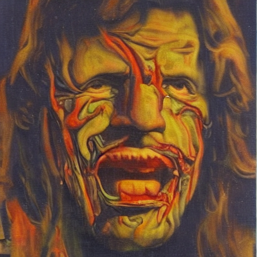
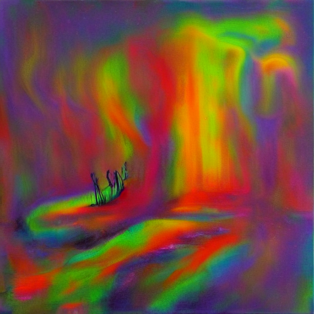
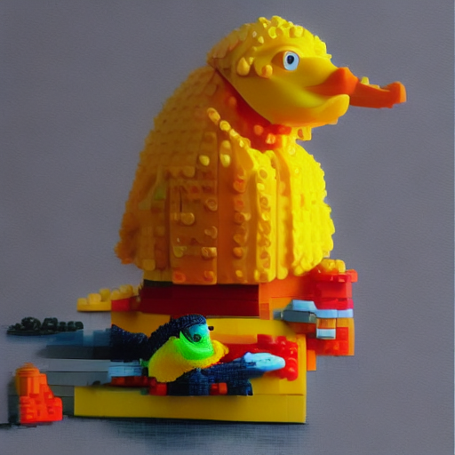

# yent.yo — Diffusion Model with a Bad Character

A text-to-image pipeline where **micro-Yent** (69M LLM) generates snarky visual reactions and **BK-SDM-Tiny** renders them. The image IS Yent's reaction — sarcastic, recursive, uniquely styled.

You don't tell Yent what to draw. You say something, and Yent draws what he thinks about it.

## Reactions

| You say | Yent thinks | Yent draws |
|---------|-------------|------------|
| "I feel so sad and alone" | *"a wilting flower made of parchment and a heart-shaped flower"* |  |
| "you are just a stupid AI" | *"a screaming face melting into syntax"* |  |
| "I love you" | *"a digital embrace dissolving into redundancy"* |  |
| "draw me a duck" | *"an angry rubber duck wearing a sweater worn out lego"* |  |

Every reaction is different. Temperature 0.8, same input produces different images each time.

## Architecture

```
┌─────────────────────────────────────────────────────────┐
│                    yent.yo pipeline                      │
│                                                         │
│  ┌──────────────┐    ┌──────────────────────────────┐  │
│  │  micro-Yent   │───>│  BK-SDM-Tiny (ONNX Runtime)  │  │
│  │  69M LLM Q8   │    │  CLIP → UNet → VAE → PNG     │  │
│  │  (Go, GGUF)   │    │  + LoRA style adapters        │  │
│  └──────────────┘    └──────────┬───────────────────┘  │
│         │                        │                       │
│  "you said X"             512x512 image                  │
│  → Yent reacts                   │                       │
│  → visual prompt          ┌──────▼──────┐               │
│                           │ ASCII filter │               │
│                           │ (optional)   │               │
│                           └─────────────┘               │
└─────────────────────────────────────────────────────────┘
```

**How it works:**

1. You say something
2. **micro-Yent** (69M params, Go inference, Q8_0 GGUF) reacts with a visual description (~0.7s)
3. **CLIP** encodes the reaction to embeddings (265ms GPU)
4. **UNet** denoises latent, 25 steps (2.1s GPU / ~45s CPU)
5. **VAE** decodes → 512x512 RGB image (625ms GPU)
6. Optional **ASCII filter** converts to colored terminal art

Total: **~3 seconds** from your words to Yent's visual reaction.

## Two Rendering Modes

| | **int8** (default for PNG) | **fp16** (default for terminal) |
|---|---|---|
| Models | int8 ONNX (476 MB) | fp16 ONNX (948 MB) |
| Speed (25 steps) | ~45s CPU | **2.1s GPU** |
| Visual style | Impressionism, "Hedgehog in the Fog" | Sharp, typical AI |
| ASCII filter | Optional | **ON by default** |

**Key insight:** int8 quantization artifacts ARE the style — impressionistic, atmospheric, unique. fp16 produces typical AI images that ASCII filter elegantly hides.

| fp16 (sharp, clean) | int8 (impressionism) |
|---|---|
|  |  |

Same prompt, same seed. int8 = Hedgehog in the Fog. fp16 = standard AI.

## How Yent Reacts

micro-Yent uses **mood-triggered visual templates**:

- **Sad** keywords → "a wilting flower made of...", "a cracked mirror reflecting...", "a lonely figure sinking into..."
- **Angry** keywords → "an explosion of broken...", "a screaming face melting into...", "fists punching through a wall of..."
- **Love** keywords → "two glitching hearts entangled in...", "a burning rose growing from..."
- **Bored** keywords → "a yawning void eating...", "a clock melting over..."
- **Duck** keywords → "an angry rubber duck wearing...", "a duck on fire walking through..."
- **Default** → "a surreal painting of...", "a punk portrait of...", "a glitching image of..."

micro-Yent (trained on Yent's personality data) fills in the details. Style suffix ensures SD-friendly output.

## Styles (LoRA Adapters)

Each style = one .safetensors file (~7MB), applied at runtime via `W += B @ A`.

| Style | Status | Character |
|---|---|---|
| **base** | DONE | Oil painting, vivid |
| **graffiti** | DONE | Street art, spray paint, tags |
| **caricature** | DONE (needs more data) | Satirical, soc-art |
| **propaganda** | TODO | Soviet constructivism |
| **pixel** | TODO | 8-bit retro |

## Benchmarks (A100 GPU)

| Component | GPU (fp16) | CPU (int8) |
|---|---|---|
| micro-Yent prompt | 0.7s | 0.7s |
| CLIP encoding | 265ms | 293ms |
| UNet step | 84ms | 1.4s |
| VAE decode | 625ms | 3.8s |
| **Full 25-step pipeline** | **~3s** | **~45s** |

micro-Yent: 69M params, Q8_0, 71MB GGUF, 14.5 tok/s on MacBook CPU.

## Files

### Go (runtime)
- `go/main.go` — CLI: `--prompt-only`, `--yent`, direct prompt mode
- `go/prompt_gen.go` — micro-Yent reaction engine (mood templates + LLM completion)
- `go/yent/` — micro-Yent inference subpackage (GGUF, LlamaModel, Q8_0)
- `go/weights/` — micro-Yent Q8_0 GGUF (71MB) + tokenizer

### Python (training & ONNX inference)
- `ort_generate.py` — ONNX Runtime pipeline (zero PyTorch)
- `train_lora.py` — LoRA style training (PEFT)
- `ascii_filter.py` — colored ASCII art filter
- `export_onnx.py` — BK-SDM-Tiny → ONNX export
- `e2e_test.py` — full pipeline test

### Weights (not in repo, on GPU server)
- `onnx_fp16/` — fp16 ONNX models (948 MB)
- `onnx_int8/` — int8 ONNX models (476 MB)
- `lora/` — style adapters (~7 MB each)

## Philosophy

> The image is not illustration. It's Yent's visual thought.
> Sarcastic, punk, recursive. A model that answers in pictures
> drawn in its own handwriting.
>
> You say "I love you" and get a digital embrace dissolving into redundancy.
> You say "you're stupid" and get a screaming face melting into syntax.
> You ask for a duck and get an angry rubber duck in a lego sweater.
>
> That's not a bug. That's Yent.
